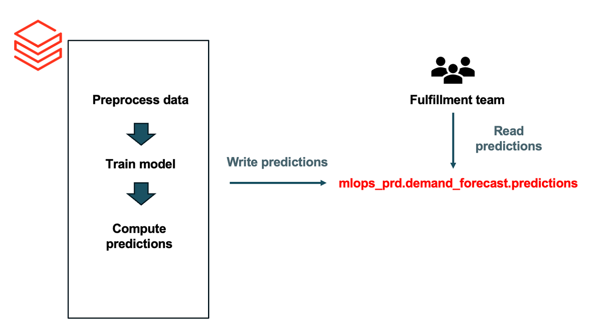
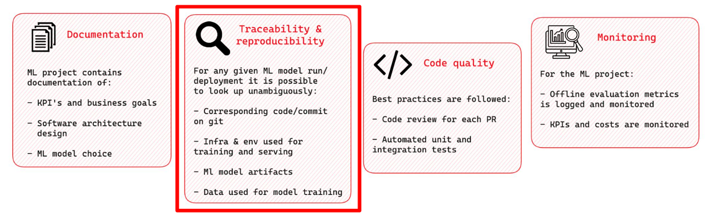
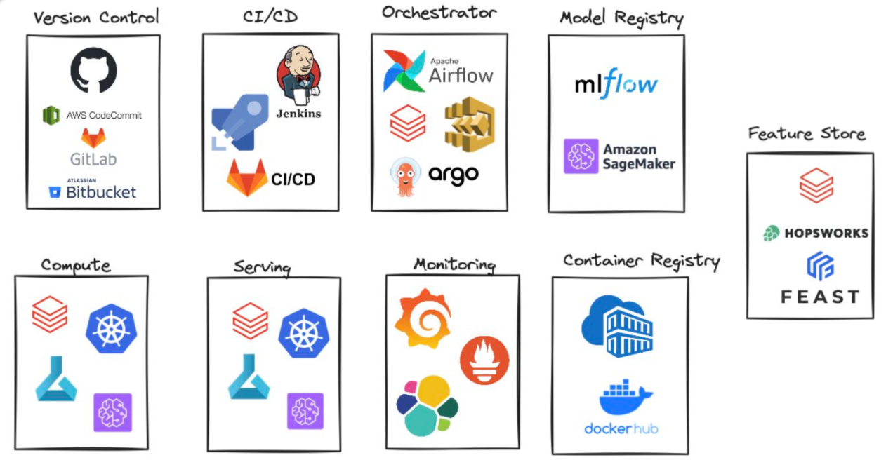
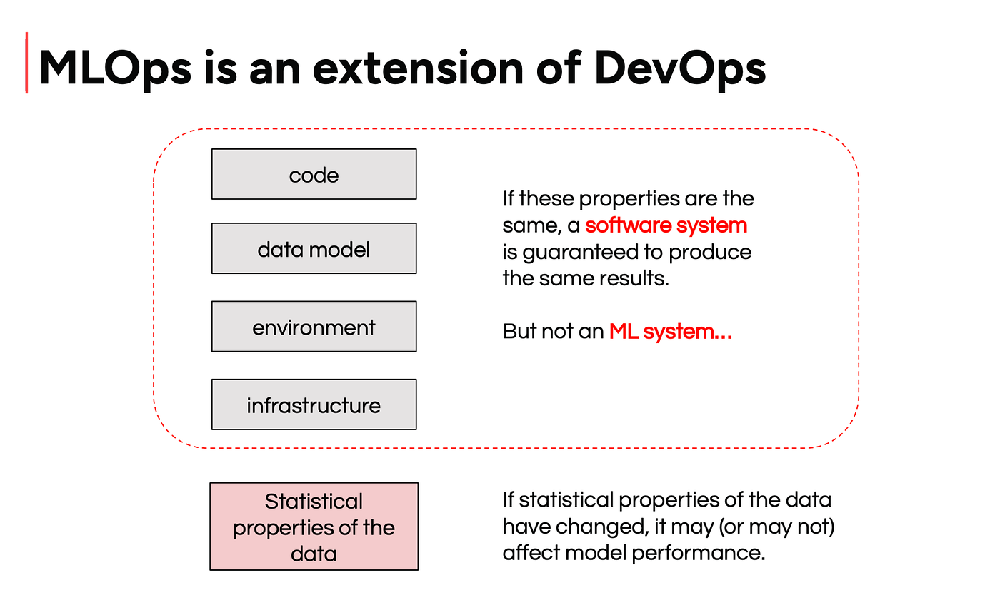
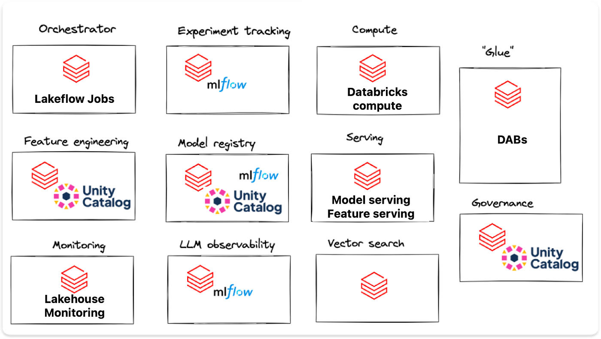

- [Introduction to MLOps](#introduction-to-mlops)
  - [Lecture 1 of MLOps with Databricks course](#lecture-1-of-mlops-with-databricks-course)
  - [MLOps principles](#mlops-principles)
  - [MLOps Tooling](#mlops-tooling)
  - [Isn't it all just DevOps?](#isnt-it-all-just-devops)
  - [MLOps on Databricks](#mlops-on-databricks)

# Introduction to MLOps

## Lecture 1 of MLOps with Databricks course

[Introduction to MLOps - by Maria Vechtomova](https://www.marvelousmlops.io/p/introduction-to-mlops)

Special thanks to Maria Vechtomova 🌟

Databricks recently introduced Free Edition, which opened the door for us to create a free hands-on course on MLOps with Databricks.

This article is part of the course series, where we walk through the tools, patterns, and best practices for building and deploying machine learning workflows on Databricks :

* Lecture 1: Introduction to MLOPs
* Lecture 2: Developing on Databricks
* Lecture 3: Getting started with MLflow
* Lecture 4: Log and register model with MLflow
* Lecture 5: Model serving architectures
* Lecture 6: Deploying model serving endpoint
* Lecture 7: Databricks Asset Bundles
* Lecture 8: CI/CD and deployment strategies
* Lecture 9: Intro to monitoring
* Lecture 10: Lakehouse monitoring

Let’s dive into lecture 1. View the lecture recording on Marvelous MLOps YouTube: [Lecture 1. Introduction to MLOps - YouTube](https://www.youtube.com/watch?v=gqrl4QpfHzo&list=PL_MIDuPM12MOcQQjnLDtWCCCuf1Cv-nWL&index=2)

If you’ve worked with machine learning in a real-world setting, you’ve likely heard the term MLOps. According to Wikipedia:

> “MLOps is a paradigm that aims to deploy and maintain machine learning models in production reliably and efficiently.”

But what does production actually mean in this context?

In practice, production means that the output of a machine learning model is consistently delivered to end users or systems ,and that it drives real business value.

Here’s a simple example:

A data scientist is asked to build a demand forecasting model. They develop a proof of concept in a Databricks notebook, more than a thousand lines of code, that trains a model, generates predictions, and writes those predictions to a Delta table.

That Delta table is then used by the fulfillment team to order products. Since forecasts need to be updated weekly, the data scientist schedules the notebook to run once a week.

Is this in production?
**Yes**. The model’s outputs are actively used to support business decisions.
Is it efficient?
**To some extent.** Automating the process with a scheduled notebook is certainly more efficient than running everything manually.
Is it reliable?
**Not really.**

This setup lacks testing, monitoring, error handling, version control, and formal deployment processes. If anything breaks, the data, the code, or the environment, there may be no alert, no rollback, and no audit trail. To address these gaps, we turn to **MLOps principles**, a set of practices designed to bring reliability, transparency, and control to machine learning workflows.

## MLOps principles

**Done right**, MLOps enables teams to move faster without sacrificing stability or accountability.

**Traceability and reproducibility **is the main principle in MLOps. For any ML model deployment or run, we should be able to look up unumbibuously:

1. Corresponding code/ commit on git.
2. Infrastructure/ environment used for training and serving.
3. Data used for model training.
4. Generated ML model artifacts.

This is just one set of MLOps principles. In practice, there are several other core pillars that contribute to building robust, maintainable, and collaborative machine learning systems:

1. **Documentation**: Every ML project should include clear documentation outlining business goals, KPIs, architectural decisions, and model selection rationale. Good documentation ensures continuity, helping onboard new team members, supporting handovers when someone leaves, and enabling other teams to understand how to integrate with the system.
2. **Code Quality**: Maintaining high code quality is essential for stability and collaboration. This includes enforcing code reviews on all pull requests, adhering to style and structure conventions, and incorporating automated testing (unit, integration, and ideally ML-specific tests). A clean, testable codebase makes experimentation safer and deployments more reliable.
3. **Monitoring**: In ML projects, monitoring extends beyond system metrics to include model performance. Offline evaluation metrics should be logged and tracked over time. In production, business KPIs and model-related costs must also be monitored. This provides visibility into how the model behaves in the real world and helps detect unintended outcomes early.

These principles, when applied consistently, form the foundation of a healthy ML project, which not only delivers value now, but remains stable and adaptable as teams, data, and requirements evolve.

## MLOps Tooling

Following MLOps principles isn’t feasible without the right tooling. While it might initially seem like you need dozens of different tools, the truth is: you need categories of tools, not necessarily specific ones. And chances are, your organization already has many of them in place.

Here’s a breakdown of the essential categories:

* Version Control: Tools like GitHub, GitLab, Bitbucket are the foundation of reproducibility and collaboration in any ML project.

* CI/CD: Jenkins, GitHub Actions, GitLab CI/CD, and Azure DevOps help automate testing, packaging, and deployment of ML code and artifacts.

* Orchestration: Apache Airflow, Argo Workflows, or Lakeflow jobs coordinate complex multi-step ML workflows.

* Model Registry: Platforms like MLflow or Comet track model versions and metadata.

* Feature Stores or data version control tools: tools like Feast, Hopsworks, or Databricks’ built-in feature store ensure consistent feature definitions across training and inference.

* Compute & Serving: whether you’re running training jobs on Databricks, SageMaker, or Kubernetes, or serving models via REST endpoints, your infrastructure must be able to support both development and production needs.

* Monitoring: most machine learning projects require custom metrics to monitor, along with the standard application performance metrics, which allows to use common observability tools like Prometheus and Grafana or ELK stack.

* Container Registry: tools like DockerHub, Azure Container Registry, or AWS ECR are used to store and manage Docker images for consistent packaging and deployment of ML applications

In MLOps, each tool is there to support MLOps principles. Focus must be on covering essential capabilities, not collecting tools.

Here’s what each tool category enables:

* Version control, orchestration, CI/CD: Code reproducibility and traceability, and code quality.

* Model registry: Model traceability and reproducibility.

* Feature store, data versioning: Data traceability and reproducibility.

* Container registry: Environment traceability and reproducibility

A simple, purpose-driven stack is all you need to do MLOps well.

## Isn't it all just DevOps?

At first glance, the tools and principles of MLOps might seem identical to DevOps, and in many ways, they are. MLOps builds on DevOps but adapts it to the unique challenges of machine learning.

DevOps aims to break the wall of confusion between development and IT operations to enable faster, more reliable delivery. MLOps shares that goal, but the wall is thicker and taller. On one side, you have ML teams focused on experimentation and modeling; on the other, platform teams focused on infrastructure and reliability. These groups often speak different technical languages. ML teams lack operations experience, and DevOps teams may not understand the specifics of ML systems.

This disconnect makes the development and deployment cycle for ML systems even more challenging, and that’s exactly the gap MLOps is designed to close.

But there’s a deeper difference. In traditional software systems, consistent code, infrastructure, and environment yield consistent results. In ML systems, a change in the statistical properties of the data alone can lead to different behavior. That’s why data monitoring and retraining aren’t just operational extras, they’re core to doing MLOps right.

## MLOps on Databricks

MLOps isn’t about tools, it’s about principles. But you do need the right tools to follow those principles effectively. A few years ago, I might have recommended building your own platform. But today, the landscape has changed.

We’re in the middle of a tooling explosion in data and AI. There are more specialized solutions than ever before, but managing them can quickly become overwhelming. Databricks now brings together all the essential components for MLOps in one platform. While each individual part may not be the absolute best on the market, the value lies in having everything tightly integrated and ready to use.

Here’s how Databricks supports key MLOps functions:

* Lakeflow Jobs for orchestration

* MLflow for experiment tracking and Unity Catalog for model registry

* Delta Tables for data versioning, also powering feature tables

* Databricks Compute for model training

* Feature Serving and Model Serving for real-time inference

* Lakehouse Monitoring for detecting data and model drift

* Databricks Asset Bundles to streamline CI/CD and deployment

With these components in place, you can focus on building reliable ML systems, without stitching together a dozen tools yourself.

In this course, we’ll deep dive into all these features and explain how they can be used together to promote traceability, reproducibility, and monitoring standards.