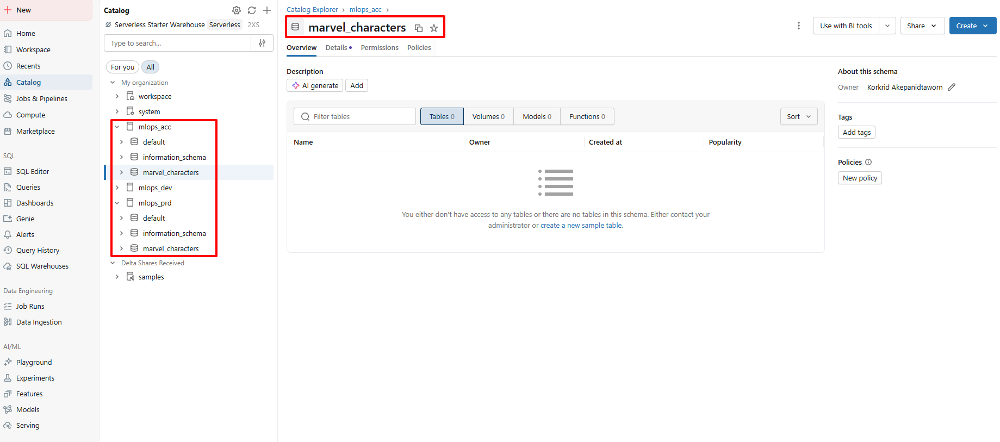
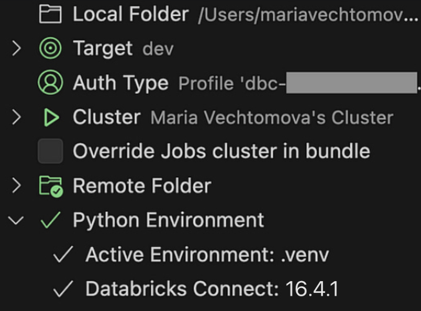
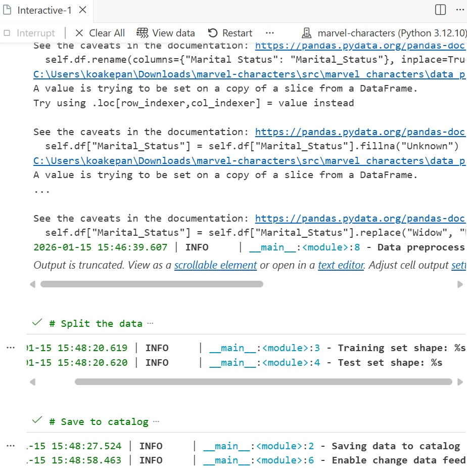

- [Developing on Databricks](#developing-on-databricks)
  - [Lecture 2 of MLOps with Databricks course](#lecture-2-of-mlops-with-databricks-course)
  - [Getting Started](#getting-started)
    - [WinGet installation for Windows](#winget-installation-for-windows)
- [Local Python environment management](#local-python-environment-management)
- [Serverless environments](#serverless-environments)
- [Project Code](#project-code)

# Developing on Databricks


## Lecture 2 of MLOps with Databricks course

Special thanks to Maria Vechtomova 🌟

Databricks recently introduced Free Edition, which opened the door for us to create a free hands-on course on MLOps with Databricks.

This article is part of the course series, where we walk through the tools, patterns, and best practices for building and deploying machine learning workflows on Databricks :

* Lecture 1: Introduction to MLOPs
* Lecture 2: Developing on Databricks
* Lecture 3: Getting started with MLflow
* Lecture 4: Log and register model with MLflow
* Lecture 5: Model serving architectures
* Lecture 6: Deploying model serving endpoint
* Lecture 7: Databricks Asset Bundles
* Lecture 8: CI/CD and deployment strategies
* Lecture 9: Intro to monitoring
* Lecture 10: Lakehouse monitoring

Most people using Databricks start by developing directly in a Databricks notebook, because it’s easy, fast, and convenient. But when it comes to MLOps, that convenience can quickly become a bottleneck. Notebooks make it difficult to write modular code, apply proper code quality standards, or run unit tests, all of which are essential for maintainable, production-grade ML systems.

Fortunately, there’s a better way. Databricks developer tools, such as VS Code extension, Databricks CLI, and Databricks Connect, allow you to develop locally using modern engineering workflows, while still running your pyspark code on Databricks.

In this lecture, we’ll show you how to use these tools to move development outside notebooks and adopt workflows that align better with MLOps practices.

## Getting Started

To follow along with the course, you’ll need to set up a few things. In the video, we demonstrate how to walk through these steps.

1. Get the Databricks free edition. The course uses Databricks free edition. Do not confuse it with Databricks free trial, it is not the same thing!

2. Fork the course repo: https://github.com/marvelousmlops/marvel-characters. Forking the repo will allow you to work on CI/CD pipeline later in the course. Clone the forked repo on your local machine.

3. Create catalogs and schemas. In the Databricks free edition workspace, create catalogs mlops_dev, mlops_acc, and mlops_prd.Under each catalog, create schema marvel_characters. These catalogs and schemas are required to run the code.



4. Install the CLI. Databricks has very good documentation on how to install it: https://docs.databricks.com/en/dev-tools/cli/install.html. From our experience, the homebrew option works great on MacOS. On Window — winget. Otherwise, you can always install from a source build.

### WinGet installation for Windows

For this installation option, you use winget to automatically download and install the latest Databricks CLI executable release.

From your Command Prompt, run the following two winget commands to install the CLI, and then restart your Command Prompt:

```
winget search databricks
winget install Databricks.DatabricksCLI
databricks -v

# Or:
databricks version
```

If the output is version 0.205.0 or above, the Databricks CLI is installed correctly.

5. Authenticate towards Databricks. Databricks CLI should be used to authenticate towards Databricks from your local machine.
  
We do not recommend using personal access tokens (from a security perspective, this is not the best option). Instead, use user-to-machine authentication. For the workspace-level commands, use the following command to authenticate:

```
databricks auth login --host <workspace-url>
```

It creates an authentication profile in .databrickscfg file that looks like this (this is not a real host, just an example):

```
[dbc-1234a567-b8c9]
host      = https://dbc-1234a567-b8c9.cloud.databricks.com/
auth_type = databricks-cli
```

6. Install Databricks VS Code extension: follow the official documentation. Once installed, update the databricks.yml file to match the host of the Databricks Free edition workspace.

# Local Python environment management

In this course, we use uv for Python project management, and we highly recommend trying it out if you haven’t already.

> [Installation | uv](https://docs.astral.sh/uv/getting-started/installation/)

The Python version and project dependencies are defined in the pyproject.toml file. You’ll notice that we specify exact versions for all packages. This is intentional, but only because the project is not meant to be reused as a library. For reusable packages, locking dependencies too strictly can lead to dependency resolution issues down the line.

In our case, the marvel-characters package is meant to be self-contained. When we install it inside a Databricks environment, we want these specific dependency versions to override the existing ones.

```
[project]
name = "marvel-characters"
description = "Marvel characters project"
requires-python = ">=3.12, <3.13"
dependencies = [
    "mlflow==3.1.1",
    "cffi==1.17.1",
    "cloudpickle==3.1.1",
    "numpy==1.26.4",
    "pandas==2.3.0",
    "pyarrow==17.0.0",
    "scikit-learn==1.7.0",
    "lightgbm==4.6.0",
    "scipy==1.16.0",
    "databricks-sdk==0.55.0",
    "pydantic==2.11.7",
    "loguru==0.7.3",
    "python-dotenv==1.1.1",
]

dynamic = ['version']

[project.optional-dependencies]
dev = ["databricks-connect>=16.3, <17",
       "ipykernel>=6.29.5, <7",
       "pip>=25.0.1, <26",
       "pre-commit>=4.1.0, <5"]

ci = ["pre-commit>=4.1.0, <5"]
```

For development purpose, we use dev optional dependency. To get started, you just need to run:

```
uv sync --extra dev
```

This command will build Python virtual environment, stored in .venv inside your project folder.

If you want to execute pyspark code on Databricks, you need to choose the cluster in the VS Code extension UI. In the Free edition that we have set up, you can only choose serverless compute. When working locally, our local Python version environment defines how the code runs. If you want to run the code in a Databricks notebook, you need to choose the corresponding serverless environment.

# Serverless environments

Currently, Databricks supports three environment versions, each comes with its own requirements. you can view the release notes for more details.

What matters is that your project’s Python version must match the environment Python version. In our case, we use Python 3.12, which matches environment version 3, which comes with the following system settings:

* Operating System: Ubuntu 24.04.2 LTS
* Python: 3.12.3
* Databricks Connect: 16.3.2

It also has certain versions of Python packages installed. Note that we are not using those package versions. For example, we use MLflow 3.1.1 instead of 2.21.3.

To see how to choose the environment version in a Databricks notebook and install the project’s dependencies, you can use Git Folder functionality. Databricks documentation walks you through the process of creating the Git folder.

After the Git folder is created, go to the notebooks folder of the project. Note that all the files inside the notebooks folder are .py files, with the first line “# Databricks notebook source”, and cells delimited by “# COMMAND — — — — — ”.

Open the lecture2.marvel_data_preprocessing.py notebook. To select an environment version: click the Environment side panel in the notebook UI, select version 3, and click apply.

To install the project dependencies, run:

```
%pip install -e ..
%restart_python
```

The project code will not be importable unless you adjust the path (which should be avoided in any other scenario).

```
from pathlib import Path
import sys
sys.path.append(str(Path.cwd().parent / 'src'))
```

Instead of using Git Folder, you can also syncronize your project folder to a location in the workspace using the sync button under “Remote Folder” in the Databricks VS Code extension.



This allows to install package in a nicer way: you can build the package locally using uv build. If the resulting wheel file is not ignored by .gitignore, it will be synced together with other files, allowing to install the wheel directly within the notebook.

Now you can run the project code in a Databricks notebook using the serverless environment 3 and our project’s dependencies. We can also execute it directly in the VS code. Let’s take a look at the code we are executing in a detail.

# Project Code

In this course, we are using the Marvel Characters dataset from Kaggle. Later in the course, we are going to use the character’s features to predict whether the character is going to survive. All the features, along with the model parameters, experiment names, and schema/ catalogs used in the projects, are stored in the `project_config_marvel.yml` file:

```
prd:
  catalog_name: mlops_prd
  schema_name: marvel_characters
acc:
  catalog_name: mlops_acc
  schema_name: marvel_characters
dev:
  catalog_name: mlops_dev
  schema_name: marvel_characters


experiment_name_basic: /Shared/marvel-characters-basic
experiment_name_custom: /Shared/marvel-characters-custom

parameters:
  learning_rate: 0.01
  n_estimators: 1000
  max_depth: 6


num_features:
  - Height
  - Weight
  
cat_features:
  - Universe
  - Identity
  - Gender
  - Marital_Status
  - Teams
  - Origin
  - Magic
  - Mutant

target: Alive
```

On purpose, we keep project configurations in a separate file, to make adjustments easily when needed.

Throughout the prokject, we use a ProjectConfig class to manage and validate project-level configuration. The configuration is validated using the pydantic library, which ensures correct data types and structure at runtime.

```
from typing import Any

import yaml
from pydantic import BaseModel


class ProjectConfig(BaseModel):
    """Represent project configuration parameters loaded from YAML.

    Handles feature specifications, catalog details, and experiment parameters.
    Supports environment-specific configuration overrides.
    """

    num_features: list[str]
    cat_features: list[str]
    target: str
    catalog_name: str
    schema_name: str
    parameters: dict[str, Any]
    experiment_name_basic: str | None
    experiment_name_custom: str | None

    @classmethod
    def from_yaml(cls, config_path: str, env: str = "dev") -> "ProjectConfig":
        """Load and parse configuration settings from a YAML file.

        :param config_path: Path to the YAML configuration file
        :param env: Environment name to load environment-specific settings
        :return: ProjectConfig instance initialized with parsed configuration
        """
        if env not in ["prd", "acc", "dev"]:
            raise ValueError(f"Invalid environment: {env}. Expected 'prd', 'acc', or 'dev'")

        with open(config_path) as f:
            config_dict = yaml.safe_load(f)
            config_dict["catalog_name"] = config_dict[env]["catalog_name"]
            config_dict["schema_name"] = config_dict[env]["schema_name"]

            return cls(**config_dict)
```

The lecture2.marvel_data_preprocessing.py notebook also starts with loading the configuration:

```
import pandas as pd
import yaml
from loguru import logger
from pyspark.sql import SparkSession

from marvel_characters.config import ProjectConfig
from marvel_characters.data_processor import DataProcessor

config = ProjectConfig.from_yaml(config_path="../project_config_marvel.yml", env="dev")

logger.info("Configuration loaded:")
logger.info(yaml.dump(config, default_flow_style=False))
```

After loading the configuration, we initialize a SparkSession. Note that SparkSession is imported from the pyspark library, but we don’t have pyspark as a project dependency. That’s because we're using databricks-connect, which includes pyspark internally. This is why these two libraries cannot be installed side by side as they would conflict with each other.

Next, we load the dataset from the data/ folder and create an instance of the DataProcessor class. This class is responsible for preprocessing the data, splitting it into training and test sets, and writing the processed data to Unity Catalog. This ensures traceability and makes it easy to reference the datasets consistently across environments.

Finally, we enable change data feed on the resulting Delta tables, which allows you to track row-level changes between versions:

```
spark = SparkSession.builder.getOrCreate()

df = pd.read_csv("../data/marvel_characters_dataset.csv")

data_processor = DataProcessor(df, config, spark)
data_processor.preprocess()

X_train, X_test = data_processor.split_data()
data_processor.save_to_catalog(X_train, X_test)
data_processor.enable_change_data_feed()
```

The preprocess() method performs data cleaning and normalization to prepare the Marvel character dataset for training. It includes the following steps:

* Column renaming for consistency
* Filling missing values in categorical columns like Universe, Origin, Identity, and Gender
* Grouping rare Universe categories under “Other”
* Converting the Teams column to a binary indicator based on whether the value is present
* Creating new binary features such as Magic and Mutant by detecting keywords in the Origin column
* Normalizing values in the Origin column into a fixed set of categories like Human, Mutant, Asgardian, Alien, etc.
* Converting the Alive column into a binary target variable and filtering only valid values
* Keeping only the selected numeric and categorical features, along with the target and PageID (which is renamed to Id)

This preprocessing step produces a clean, well-structured dataset that’s ready for model training. We’ll use it in Lecture 4, where we focus on training, logging, and registering a model. But before that, in the next lecture, we’ll explore MLflow experiment tracking, the foundation of everything that happens within MLflow.

