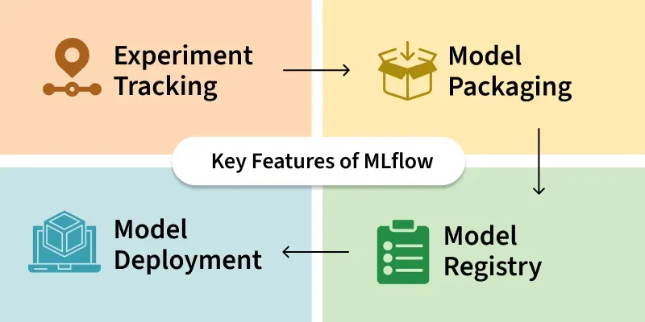
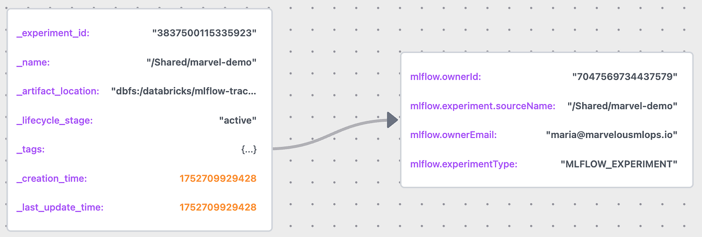
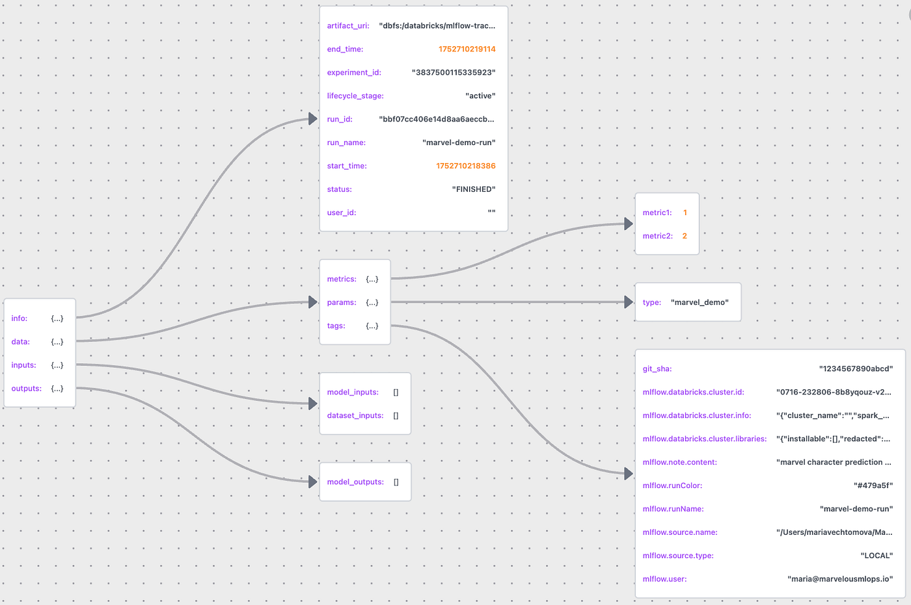
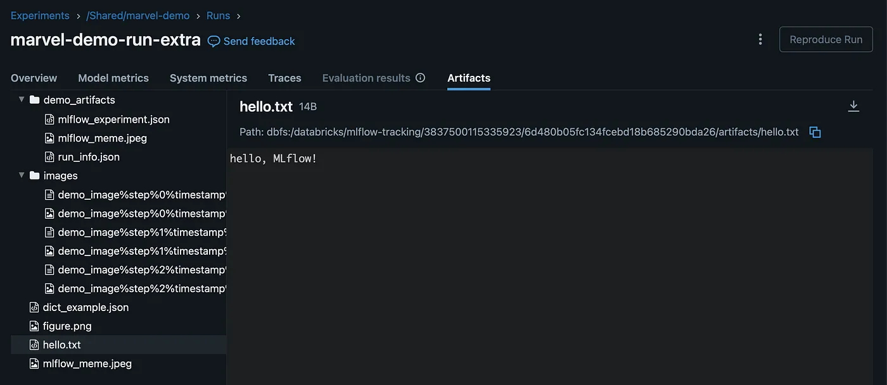
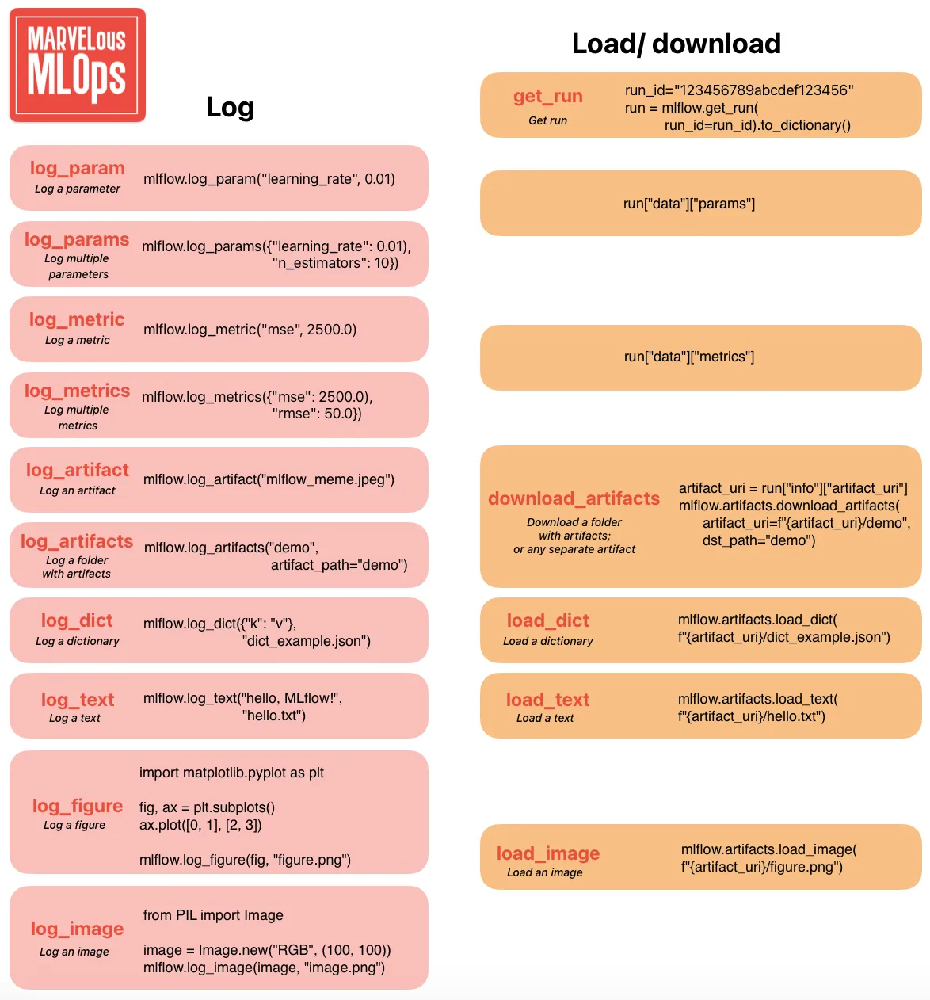
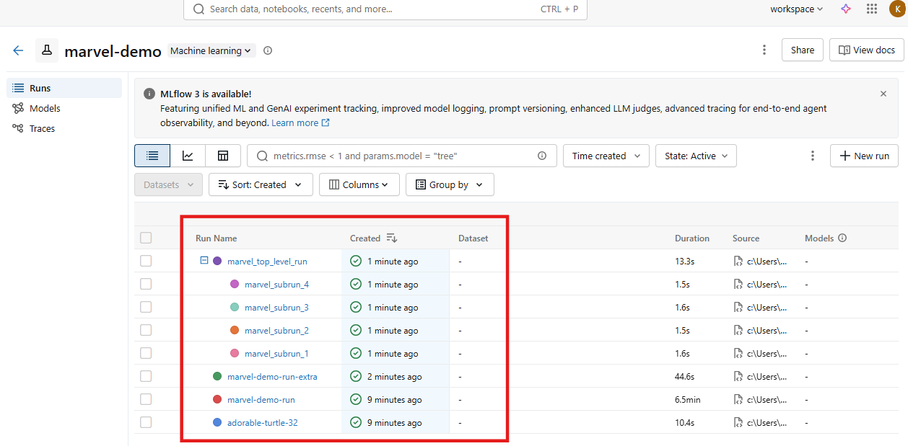

- [Getting Started with MLflow](#getting-started-with-mlflow)
  - [Lecture 3 of MLOps with Databricks course](#lecture-3-of-mlops-with-databricks-course)
  - [Tracking URI](#tracking-uri)
  - [MLflow Experiment](#mlflow-experiment)
  - [MLflow Run](#mlflow-run)
  - [Logging and loading artifacts](#logging-and-loading-artifacts)
  - [Marvel Demo's Run](#marvel-demos-run)

# Getting Started with MLflow


## Lecture 3 of MLOps with Databricks course

Special thanks to Maria Vechtomova 🌟

Databricks recently introduced Free Edition, which opened the door for us to create a free hands-on course on MLOps with Databricks.

This article is part of the course series, where we walk through the tools, patterns, and best practices for building and deploying machine learning workflows on Databricks :

* Lecture 1: Introduction to MLOPs
* Lecture 2: Developing on Databricks
* Lecture 3: Getting started with MLflow
* Lecture 4: Log and register model with MLflow
* Lecture 5: Model serving architectures
* Lecture 6: Deploying model serving endpoint
* Lecture 7: Databricks Asset Bundles
* Lecture 8: CI/CD and deployment strategies
* Lecture 9: Intro to monitoring
* Lecture 10: Lakehouse monitoring

**MLflow** is probably the most popular tool for model registry and experiment tracking out there. MLFlow is open source and integrates with a lot of platforms and tools.



Due to its extensive support and a lot of options, getting started with MLflow may feel overwhelming. In this lecture, we will get back to the basics, and will review 2 most important classes in MLFlow that form the foundation of everything else, ``mlflow.entities.Experiment`` and ``mlflow.entities.Run``.

We will see how those entities get created, how you can retrieve them, and how they change based on different input parameters. In this course, the Databricks version of MLflow is used, so it contains some Databricks-specific information. However, the idea is generalizable to any MLflow instance.

Before we go any further, let’s discuss how we can authenticate towards MLflow tracking server on Databricks.

## Tracking URI

By default, MLflow will track experiment runs using the local file systems, and all the metadata will be stored in the ./mlruns directory. We can verify that by retrieving the current tracking URI:

```
import mlflow
mlflow.get_tracking_uri()
```

In lecture 2, we explained how we can authenticate towards Databricks using Databricks CLI, which we continued to use when developing in VS Code. Now we must make MLflow aware of it, and use Databricks MLflow tracking server.

This can be done by calling mlflow.set_tracking_uri().Even though we’re only using experiment tracking for now, starting with MLflow 3, it’s also necessary to set the registry URI using mlflow.set_registry_uri(). There are a couple of things to pay attention to:

The tracking and the registry URI must contain the profile that you used to log in (which is defined in the .databrickscfg file, for exampledbc-1234a567-b8c9).

We want multiple developers with a different profile name to collaborate on the same code base.

We only want to set the tracking and the registry URI when running code outside of Databricks.

This leads us to the following possible solution. We can then define whether the code runs within a Databricks environment by checking that the DATABRICKS_RUNTIME_VERSION environment variable is available. Every developer can store the profile name in .env file (which is ignored by git via .gitignore file), and set environment variable PROFILE using Python package dotenv:

```
import os
import mlflow
from dotenv import load_dotenv

def is_databricks() -> bool:
    """Check if the code is running in a Databricks environment."""
    return "DATABRICKS_RUNTIME_VERSION" in os.environ

if not is_databricks():
    load_dotenv()
    profile = os.environ.get("PROFILE")
    mlflow.set_tracking_uri(f"databricks://{profile}")
    mlflow.set_registry_uri(f"databricks-uc://{profile}")
```

This is how the content of the .env file would look like:

```
# content of the .env file
PROFILE=dbc-1234a567-b8c9
```

Now we use Databricks MLflow as tracking server, we can create an experiment.

## MLflow Experiment

Experiments in MLflow are the **main unit of organization** for ML model training runs. All MLflow runs belong to an experiment.

An MLflow experiment can be created using either the mlflow.create_experiment or mlflow.set_experimentcommand. The latter is more commonly used, as it will activate an existing experiment by name or create a new one if it doesn't already exist.

It is possible to add tags to your experiment by passing them as a parameter to the mlflow.create_experiment command. If the experiment already exists, tags can be added using the mlflow.set_experiment_tags command after the experiment has been activated:

```
experiment = mlflow.set_experiment(experiment_name="/Shared/marvel-demo")
mlflow.set_experiment_tags(
    {"repository_name": "marvelousmlops/marvel-characters"})
```

The above commands will result in the creation of an instance of ``mlflow.entities.Experiment`` class with the following attributes:



The MLflow experiment created above can be now found by name or by tag:

```
# search experiment by name
mlflow.search_experiments(filter_string="name='/Shared/demo'")

# search experiment by tag
mlflow.search_experiments(
    filter_string="tags.repository_name='marvelousmlops/marvel-characters'")
```

It is also possible to search for experiments by last_update_time or creation time. We can also get an experiment by experiment id:

```
mlflow.get_experiment(experiment.experiment_id)
```

## MLflow Run

After the experiment is created, we can create an experiment run. An MLflow run is related to a single execution of ML model training code, under an MLflow run a lot of things can be logged: params, metrics, and artifacts of different formats.

An MLflow run is created using the mlflow.start_run command. This command is typically used within a with block to ensure proper handling of the run lifecycle. If you don’t use a with block, you must explicitly end the run by calling mlflow.end_run. Here, we log some metrics and a parameter:

```
with mlflow.start_run(
    run_name="marvel-demo-run",
    tags={"git_sha": "1234567890abcd"},
    description="marvel character prediction demo run",
) as run:
    run_id = run.info.run_id
    mlflow.log_params({"type": "marvel_demo"})
    mlflow.log_metrics({"metric1": 1.0, "metric2": 2.0})
```

The code above will result in the creation of an instance of mlflow.entities.Run class. It’s easy to visualize how the MLflow run class is constructed by saving the run information as a JSON file and using JSON Lens:



We can notice the git_sha tag that we passed to the run, and some tags were created by MLflow. The tags would be different depending on where this run was created. For example, if the run was created when running in a Lakeflow job, the job id and the task run id will be available as tags.

The run can be restarted by passing the run id to the mlflow.start_run() command. We can log extra information as part of the run, but we can’t overwrite existing metrics and parameters.

## Logging and loading artifacts

Let’s now start a new run and log various artifacts:

```
import matplotlib.pyplot as plt
import numpy as np

mlflow.start_run(run_name="marvel-demo-run-extra",
                 tags={"git_sha": "1234567890abcd"},
                       description="marvel demo run with extra artifacts",)
mlflow.log_metric(key="metric3", value=3.0)
# dynamically log metric (trainings epochs)
for i in range(0,3):
    mlflow.log_metric(key="metric1", value=3.0+i/2, step=i)
mlflow.log_artifact("../demo_artifacts/mlflow_meme.jpeg")
mlflow.log_text("hello, MLflow!", "hello.txt")
mlflow.log_dict({"k": "v"}, "dict_example.json")
mlflow.log_artifacts("../demo_artifacts", artifact_path="demo_artifacts")

# log figure
fig, ax = plt.subplots()
ax.plot([0, 1], [2, 3])

mlflow.log_figure(fig, "figure.png")

# log image dynamically
for i in range(0,3):
    image = np.random.randint(0, 256, size=(100, 100, 3), 
                              dtype=np.uint8)
    mlflow.log_image(image, key="demo_image", step=i)

mlflow.end_run()
```

We can view the experiment run in the UI and find all the artifacts under the **Artifacts** tab:



We can also search for the run programmatically. Notice that we can filter our search results based on tags, run name, metrics, status, and tags:

```
from time import time

time_hour_ago = int(time() - 3600) * 1000

runs = mlflow.search_runs(
    search_all_experiments=True, #or experiment_ids=[], or experiment_names=[]
    order_by=["start_time DESC"],
    filter_string="status='FINISHED' AND "
                  f"start_time>{time_hour_ago} AND "
                  "run_name LIKE '%marvel-demo-run%' AND "
                  "metrics.metric3>0 AND "
                  "tags.mlflow.source.type!='JOB'"
```

We can now load the artifacts using the appropriate MLflow load functions, and download all artifacts using the download_artifacts() function.

```
artifact_uri = runs.artifact_uri[0]
mlflow.artifacts.load_dict(f"{artifact_uri}/dict_example.json")

mlflow.artifacts.load_image(f"{artifact_uri}/figure.png")

mlflow.artifacts.download_artifacts(
    artifact_uri=f"{artifact_uri}/demo_artifacts",
    dst_path="../downloaded_artifacts")
```

To simplify your understanding of logging and loading artifacts in MLflow, we prepared a cheatsheet. In the next lecture, we’ll go through logging and registering models.



## Marvel Demo's Run

