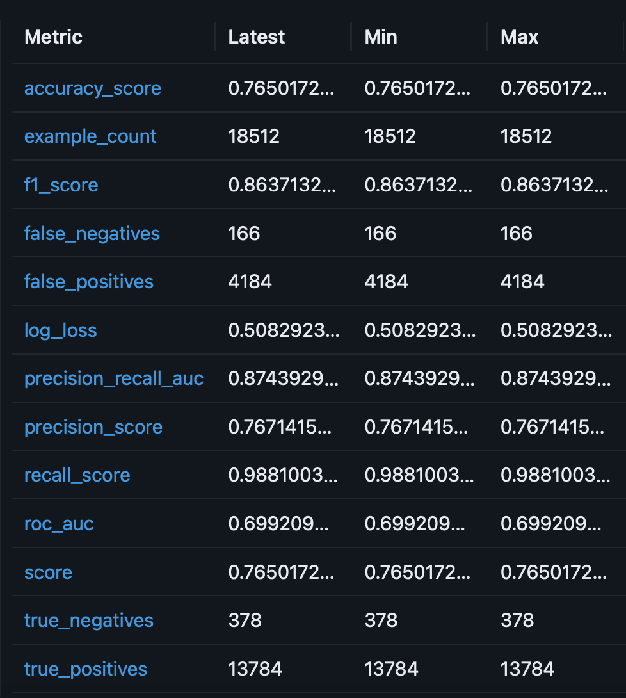
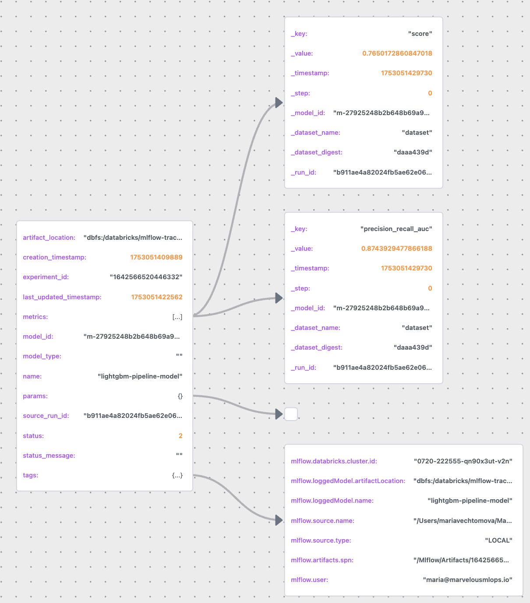
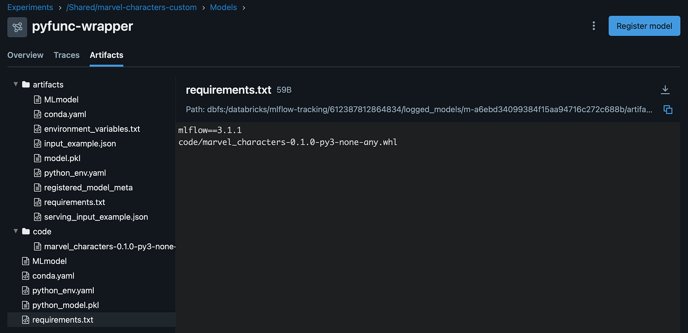

- [Logging and registering models with MLflow](#logging-and-registering-models-with-mlflow)
  - [Lecture 4 of MLOps with Databricks course](#lecture-4-of-mlops-with-databricks-course)
  - [Basic model: log, train, and register](#basic-model-log-train-and-register)
  - [Wrapping the model using pyfunc](#wrapping-the-model-using-pyfunc)
  - [Conclusions](#conclusions)

# Logging and registering models with MLflow


## Lecture 4 of MLOps with Databricks course

Special thanks to Maria Vechtomova 🌟

Databricks recently introduced Free Edition, which opened the door for us to create a free hands-on course on MLOps with Databricks.

This article is part of the course series, where we walk through the tools, patterns, and best practices for building and deploying machine learning workflows on Databricks :

* Lecture 1: Introduction to MLOPs
* Lecture 2: Developing on Databricks
* Lecture 3: Getting started with MLflow
* Lecture 4: Log and register model with MLflow
* Lecture 5: Model serving architectures
* Lecture 6: Deploying model serving endpoint
* Lecture 7: Databricks Asset Bundles
* Lecture 8: CI/CD and deployment strategies
* Lecture 9: Intro to monitoring
* Lecture 10: Lakehouse monitoring

In the previous lecture, we have logged metrics, parameters, various artifacts, but have not logged a model yet. You could just saved a model in a .pkl file, but MLflow goes beyond that: it provides a standardized format called an MLflow Model, which defines how a model, its dependencies, and its code are stored. This is essential for downstream tasks like real-time serving, which will be covered later in the course.

A model can be logged using the mlflow.<model_flavor>.log_model() function. MLflow supports a wide range of flavors, such as lightgbm, prophet, pytorch, sklearn, xgboost, and many more. It also supports any custom model logics through PythonModel base class , which can be logged using pyfunc flavor.

## Basic model: log, train, and register

To demonstrate logging, we’ll start with training a scikit-learn pipeline (referred to as Basic model) and logging it using sklearn flavor. We’ll walk through the notebooks/lecture4.train_register_basic_model.py code from the course GitHub repo.

Since we are interacting with MLflow, we need to set up tracking and registry URIs just as we did in lecture 3:

```
import mlflow
import os
from dotenv import load_dotenv

def is_databricks():
    return "DATABRICKS_RUNTIME_VERSION" in os.environ

if not is_databricks():
    load_dotenv()
    profile = os.environ["PROFILE"]
    mlflow.set_tracking_uri(f"databricks://{profile}")
    mlflow.set_registry_uri(f"databricks-uc://{profile}")
```

Then we’ll load the project configuration, initialize the SparkSession, and define tags we’ll need to tag the MLflow run and registered model:

```
from pyspark.sql import SparkSession

from marvel_characters.config import ProjectConfig, Tags

config = ProjectConfig.from_yaml(config_path="../project_config_marvel.yml", env="dev")
spark = SparkSession.builder.getOrCreate()
tags = Tags(**{"git_sha": "abcd12345", "branch": "main"})
```

We’ll need those to initialize an instance of BasicModel class. Then we load the data, prepare features, train and log the model:

```
from marvel_characters.models.basic_model import BasicModel

basic_model = BasicModel(config=config,
                         tags=tags,
                         spark=spark)

basic_model.load_data()
basic_model.prepare_features()

basic_model.train()

basic_model.log_model()
```

Let’s go through the logics behind the BasicModel class to understand what’s going on. After the class gets initialized, we set certain class attributes such as features, target, parameters, and model name.

We load the train and the test set using pyspark, and we’ll need these pyspark dataframes later to log the model input, together with the delta table version we retrieve. We also use toPandas() command to create pandas dataframes which are used for model training and evaluation.

Note that toPandas() command is rather inefficient, and if your dataset is large, you may want to look for alternatives, such as using deltatable package and external credentials vending in the way described in an earlier article. Logging input data in this case can be quite challenging.

```
import mlflow
import pandas as pd
from delta.tables import DeltaTable
from lightgbm import LGBMClassifier
from loguru import logger
from mlflow import MlflowClient
from mlflow.models import infer_signature
from pyspark.sql import SparkSession
from sklearn.base import BaseEstimator, TransformerMixin
from sklearn.compose import ColumnTransformer
from sklearn.pipeline import Pipeline

from marvel_characters.config import ProjectConfig, Tags

class BasicModel:
    """A basic model class for Marvel character survival prediction 
       using LightGBM.
    """

    def __init__(self, config: ProjectConfig, 
                 tags: Tags, spark: SparkSession) -> None:

        self.config = config
        self.spark = spark
        self.tags = tags.to_dict()

        # Extract settings from the config
        self.num_features = self.config.num_features
        self.cat_features = self.config.cat_features
        self.target = self.config.target
        self.parameters = self.config.parameters
        self.catalog_name = self.config.catalog_name
        self.schema_name = self.config.schema_name
        self.experiment_name = self.config.experiment_name_basic
        self.model_name = f"{self.catalog_name}.{self.schema_name}.marvel_character_model_basic"
    
def load_data(self) -> None:
        """Load training and testing data from Delta tables.
        """
        logger.info("🔄 Loading data from Databricks tables...")
        self.train_set_spark = self.spark.table(f"{self.catalog_name}.{self.schema_name}.train_set")
        self.train_set = self.train_set_spark.toPandas()
        self.test_set_spark = self.spark.table(f"{self.catalog_name}.{self.schema_name}.test_set")
        self.test_set =  self.test_set_spark.toPandas()

        self.X_train = self.train_set[self.num_features + self.cat_features]
        self.y_train = self.train_set[self.target]
        self.X_test = self.test_set[self.num_features + self.cat_features]
        self.y_test = self.test_set[self.target]
        self.eval_data = self.test_set[self.num_features + self.cat_features + [self.target]]

        train_delta_table = DeltaTable.forName(self.spark,
                                               f"{self.catalog_name}.{self.schema_name}.train_set")
        self.train_data_version = str(train_delta_table.history().select("version").first()[0])
        test_delta_table = DeltaTable.forName(self.spark,
                                               f"{self.catalog_name}.{self.schema_name}.test_set")
        self.test_data_version = str(test_delta_table.history().select("version").first()[0])
        logger.info("✅ Data successfully loaded.")
```

The next method defined in the class is prepare_features(), which defines the sklearn pipeline that consists of 2 steps: encoding categorical variables using a custom encoder CatToIntTransofrmer, and LGBMClassifier.

LightGBM supports integer-encoded categorical features, which generally performs better than one-hot encoding. A custom encoder is necessary to make sure the LightGBM model treats integer-encoded features as categorical features, and earlier unseen categories get value -1 assigned to avoid errors while computing predictions.

You may notice that the CatToIntTransformer class is defined inside the prepare_features method. While this isn’t ideal from a design standpoint, it keeps the model self-contained, and we do not need to log our private package together with the model if we want to use the model for the downstream tasks. We’ll show a better to handle private dependencies when we discuss a custom pyfunc model later in this article.

```
def prepare_features(self) -> None:
        """Encode categorical features and define a preprocessing pipeline.
        """
        logger.info("🔄 Defining preprocessing pipeline...")

        class CatToIntTransformer(BaseEstimator, TransformerMixin):
            """Transformer that encodes categorical columns as 
               integer codes for LightGBM.

            Unknown categories at transform time are encoded as -1.
            """

            def __init__(self, cat_features: list[str]) -> None:
                """Initialize the transformer with categorical feature names."""
                self.cat_features = cat_features
                self.cat_maps_ = {}

            def fit(self, X: pd.DataFrame, y=None) -> None:
                """Fit the transformer to the DataFrame X."""
                self.fit_transform(X)
                return self

            def fit_transform(self, X: pd.DataFrame, y=None) -> pd.DataFrame:
                """Fit and transform the DataFrame X."""
                X = X.copy()
                for col in self.cat_features:
                    c = pd.Categorical(X[col])
                    # Build mapping: {category: code}
                    self.cat_maps_[col] = dict(zip(c.categories, 
                                      range(len(c.categories)), strict=False))
                    X[col] = X[col].map(lambda val, col=col: self.cat_maps_[col].get(val, -1)).astype("category")
                return X

            def transform(self, X: pd.DataFrame) -> pd.DataFrame:
                """Transform the DataFrame X by encoding categorical features as integers."""
                X = X.copy()
                for col in self.cat_features:
                    X[col] = X[col].map(lambda val, col=col: self.cat_maps_[col].get(val, -1)).astype("category")
                return X

        preprocessor = ColumnTransformer(
            transformers=[("cat", CatToIntTransformer(self.cat_features), self.cat_features)],
            remainder="passthrough"
        )
        self.pipeline = Pipeline(
            steps=[("preprocessor", preprocessor),
                   ("classifier", LGBMClassifier(**self.parameters))])
        logger.info("✅ Preprocessing pipeline defined.")
```

The train() fits the pipeline, and the log_model() method logs the model with all the required information:

- **Signature** is inferred using model input (X_train) and model output (the result of running the predict function on the pipeline), and passed when logging the model. If the signature is not provided, we would not be able to register model in Unity Catalog later.

- **Input datasets** (train and test sets, including the delta table version) are logged under the MLflow run to ensure that we can get the exact version of data used for training and evaluation, even if data was modified later, thanks to the time travel functionality of delta tables. Remember to set a proper retention period on the delta table (default is 7 days), otherwise you may not be able to access the exact version of the table if VACUUM command was executed. Most accounts have predictive optimization enabled by default, which means that Databricks automatically executes it as part of the optimization process.

```
 def train(self) -> None:
        """Train the model."""
        logger.info("🚀 Starting training...")
        self.pipeline.fit(self.X_train, self.y_train)

    def log_model(self) -> None:
        """Log the model using MLflow."""
        mlflow.set_experiment(self.experiment_name)
        with mlflow.start_run(tags=self.tags) as run:
            self.run_id = run.info.run_id

            signature = infer_signature(model_input=self.X_train,
                                        model_output=self.pipeline.predict(self.X_train))
            train_dataset = mlflow.data.from_spark(
                self.train_set_spark,
                table_name=f"{self.catalog_name}.{self.schema_name}.train_set",
                version=self.train_data_version,
            )
            mlflow.log_input(train_dataset, context="training")
            test_dataset = mlflow.data.from_spark(
                self.test_set_spark,
                table_name=f"{self.catalog_name}.{self.schema_name}.test_set",
                version=self.test_data_version,
            )
            mlflow.log_input(test_dataset, context="testing")
            self.model_info = mlflow.sklearn.log_model(
                sk_model=self.pipeline,
                artifact_path="lightgbm-pipeline-model",
                signature=signature,
                input_example=self.X_test[0:1]
            )

            result = mlflow.models.evaluate(
                    self.model_info.model_uri,
                    self.eval_data,
                    targets=self.config.target,
                    model_type="classifier",
                    evaluators=["default"],
                )
            self.metrics = result.metrics
```

Notice that we do not log any metrics. The metrics gets computed and logged under the same run using the mlflow.models.evaluate() function, which requires model URI, evaluation data, target, model type, and evaluators to run. Here, we use default evaluators, which means that standard metrics from the default evaluator gets logged:



After the model is logged, we can get the logged model using the model id (we can also use model id in the model URI to load the model):

```
logged_model = mlflow.get_logged_model(basic_model.model_info.model_id)
model = mlflow.sklearn.load_model(f"models:/{basic_model.model_info.model_id}")
```

This was not possible before MLflow 3, which introduced the concept of the LoggedModel. We also now have a separate model tab under the MLflow experiments in the UI. Let’s inspect the LoggedModel class. On purpose, I removed some metrics from the illustration (in fact, there is a separate entry for each metric shown in the table from the UI earlier).



It’s possible to access the model’s metrics and parameters (we have not logged any) directly from the **LoggedModel** class (which was only possible via the MLflow run in earlier versions of MLflow):

```
logged_model.params
logged_model.metrics
```

We still nee the run object to retrieve the information about the dataset inputs which were used to train and to evaluate the model:

```
run = mlflow.get_run(basic_model.run_id)


inputs = run.inputs.dataset_inputs
training_input = next((x for x in inputs if len(x.tags)>0 and x.tags[0].value == 'training'), None)
training_source = mlflow.data.get_source(training_input)
training_source.load()

testing_input = next((x for x in inputs if len(x.tags)>0 and x.tags[0].value == 'testing'), None)
testing_source = mlflow.data.get_source(testing_input)
testing_source.load()
```

The BasicModel class has another method, register_model(), which registers model in the Unity Catalog, together with the provided tags.

```
def register_model(self) -> None:
        """Register model in Unity Catalog."""
        logger.info("🔄 Registering the model in UC...")
        registered_model = mlflow.register_model(
            model_uri=self.model_info.model_uri,
            name=self.model_name,
            tags=self.tags,
        )
        logger.info(f"✅ Model registered as version {registered_model.version}.")

        latest_version = registered_model.version

        client = MlflowClient()
        client.set_registered_model_alias(
            name=self.model_name,
            alias="latest-model",
            version=latest_version,
        )
        return latest_version
```

Notice that we set the “latest-model” alias to make it easy to find the latest version of the registered model. “Latest” is a reserved value for the alias and can’t be used, and models can’t be referred as “latest” either.

Searching for model versions is pretty hard otherwise: you can only search by model name or alias. Searching using filter strings is not supported when model is registered in Unity Catalog.

## Wrapping the model using pyfunc

Model signature in MLflow defines how different interfaces interact with the model. For instance, it defines the payload of the endpoint if the model gets served using Databricks model serving.

We’ve just registered a sklearn pipeline. If we deploy it behind an endpoint and query it, we will get an output in the format: {“Predictions”: [0]}. A pyfunc model flavor becomes useful if we want to adjust the model payload.

There are other scenarios when you may want to use a pyfunc. For example, if we need to access other systems (for example, a database) to return predictions, or if model serving requires specific artifacts (other files or even models).

Essentially, we are using pyfunc as a wrapper (In a certain sense, it’s very similar to the functionality of a FastAPI). Keeping the definition of the payload separate from the model itself is convenient : we can easily adjust the pyfunc wrapper definition without touching the registered model itself.

Let’s demonstrate how a pyfunc wrapper can be used. Under the custom_model module of the marvel-characters package, we defined the MarvelModelWrapper class. It has the load_context method which loads the basic model we trained earlier. The basic model gets loaded from the context, which gets stored together with the logged pyfunc model when we run the mlflow.pyfunc.log_model() function.

Notice that the predict method uses the adjust_predictions function defined outside of the MarvelModelWrapper, which means that the marvel_characters package must be now logged together with the pyfunc wrapper.

```
from datetime import datetime

import mlflow
import numpy as np
import pandas as pd
from mlflow import MlflowClient
from mlflow.models import infer_signature
from mlflow.pyfunc import PythonModelContext
from mlflow.utils.environment import _mlflow_conda_env

from marvel_characters.config import Tags


def adjust_predictions(predictions):
    return {"Survival prediction": ["alive" if pred == 1 else "dead" for pred in predictions]}

class MarvelModelWrapper(mlflow.pyfunc.PythonModel):

    def load_context(self, context: PythonModelContext) -> None:
        self.model = mlflow.sklearn.load_model(
            context.artifacts["lightgbm-pipeline"]
        )

    def predict(self, context: PythonModelContext, model_input: pd.DataFrame | np.ndarray) -> dict:
        predictions = self.model.predict(model_input)
        return adjust_predictions(predictions)
```

Let’s take a look at the log_register_model method. It takes the code_paths argument, which contains a local path to the marvel_characters package wheel. We use this list to define the conda_env. The location of the wheel in the artifacts folder (it will be saved in the code folder) is defined as a dependency.

Both code_paths and conda_env must be passed as an argument to the mlflow.pyfunc.log_model() function. Here, we also pass artifacts, which is a dictionary that contains the basic model URI.

```
def log_register_model(self, wrapped_model_uri: str, pyfunc_model_name: str,
                           experiment_name: str, tags: Tags, code_paths: list[str],
                           input_example: pd.DataFrame) -> None:
        mlflow.set_experiment(experiment_name=experiment_name)
        with mlflow.start_run(run_name=f"wrapper-lightgbm-{datetime.now().strftime('%Y-%m-%d')}",
            tags=tags.to_dict()):
            additional_pip_deps = []
            for package in code_paths:
                whl_name = package.split("/")[-1]
                additional_pip_deps.append(f"code/{whl_name}")
            conda_env = _mlflow_conda_env(additional_pip_deps=additional_pip_deps)

            signature = infer_signature(model_input=input_example,
                                        model_output={"Survival prediction": ["alive"]})
            model_info = mlflow.pyfunc.log_model(
                python_model=self,
                name="pyfunc-wrapper",
                artifacts={
                    "lightgbm-pipeline": wrapped_model_uri},
                signature=signature,
                code_paths=code_paths,
                conda_env=conda_env,
            )
        client = MlflowClient()
        registered_model = mlflow.register_model(
                model_uri=model_info.model_uri,
                name=pyfunc_model_name,
                tags=tags.to_dict(),
            )
        latest_version = registered_model.version
        client.set_registered_model_alias(
            name=pyfunc_model_name,
            alias="latest-model",
            version=latest_version,
        )
        return latest_version
```

The pyfunc wrapper gets registered in the same way as the basic model, here we also set the “latest-model” alias. This is how we log and register the pyfunc wrapper in notebooks/lecture4.train_register_custom_model.py:

```
from importlib.metadata import version

marvel_characters_v = version("marvel_characters")

code_paths=[f"../dist/marvel_characters-{marvel_characters_v}-py3-none-any.whl"]

client = MlflowClient()
wrapped_model_version = client.get_model_version_by_alias(
    name=f"{config.catalog_name}.{config.schema_name}.marvel_character_model_basic",
    alias="latest-model")

test_set = spark.table(f"{config.catalog_name}.{config.schema_name}.test_set").toPandas()
X_test = test_set[config.num_features + config.cat_features]

pyfunc_model_name = f"{config.catalog_name}.{config.schema_name}.marvel_character_model_custom"
wrapper = MarvelModelWrapper()
wrapper.log_register_model(wrapped_model_uri=f"models:/{wrapped_model_version.model_id}",
                           pyfunc_model_name=pyfunc_model_name,
                           experiment_name=config.experiment_name_custom,
                           input_example=X_test[0:1],
                           tags=tags,
                           code_paths=code_paths)
```

After the pyfunc model is logged and registered, we can see in the UI how its artifacts are stored. We can find the basic model’s artifacts in the artifacts folder, and the package wheel in the code folder. Notice that the wheel is referenced in the requirements.txt. When the environment gets created, all the dependencies of our private package get installed.



The model can be loaded using the mlflow.pyfunc.load_model() function. If we want to access the original MarvelModelWrapper class and its attributes, we must use the unwrap_python_model() method.

We can run the predict function after we loaded the model. However, this does not guarantee that the model will be loaded successfully at the serving step. That’s because we are utilizing our existing environment.

```
loaded_pufunc_model = mlflow.pyfunc.load_model(f"models:/{pyfunc_model_name}@latest-model")

unwraped_model = loaded_pufunc_model.unwrap_python_model()

unwraped_model.predict(context=None, model_input=X_test[0:1])
```

There is a more reliable way that mimics the creation of model serving environment. Note that this code only runs from Databricks environment and would not work in the VS Code.

```
predictions = mlflow.models.predict(
    f"models:/{pyfunc_model_name}@latest-model",
    X_test[0:1])
```

## Conclusions

In this lecture, we went beyond logging metrics and parameters, and logged and registered a model with MLflow. We made sure to capture the model signature, dataset versions, and tags containing the code version (for now, just a dummy value) so our runs are fully reproducible.

We registered the model in Unity Catalog and wrapped it in a pyfunc to control the output and package extra dependencies for serving.

Next up, we’ll dive into model serving architectures and see how all of this comes together in production.