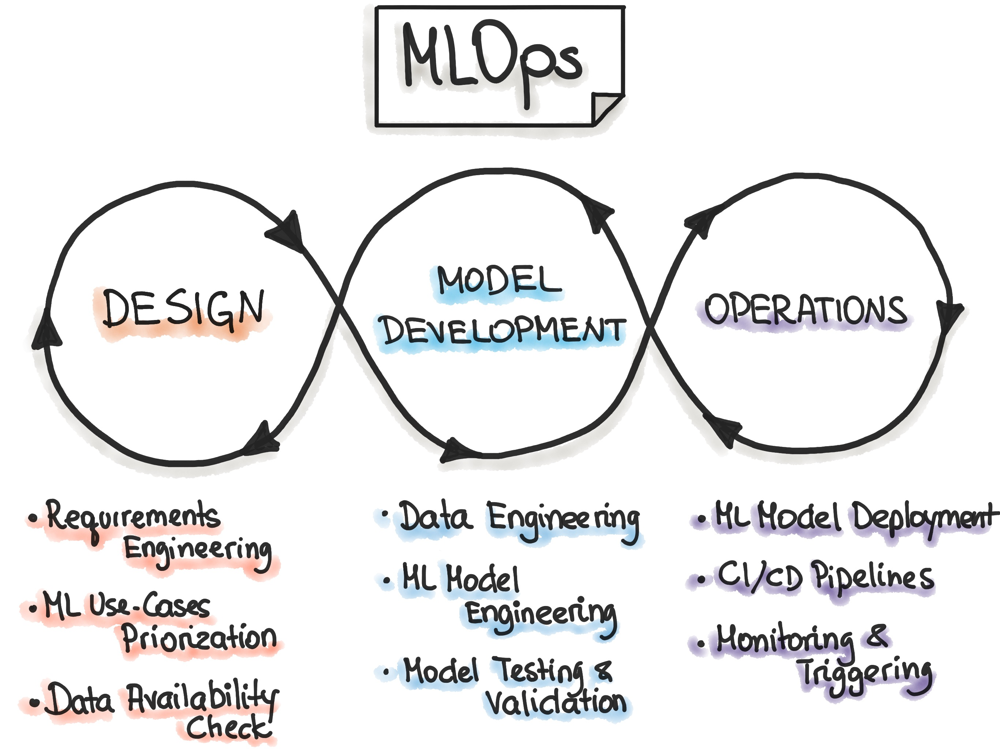
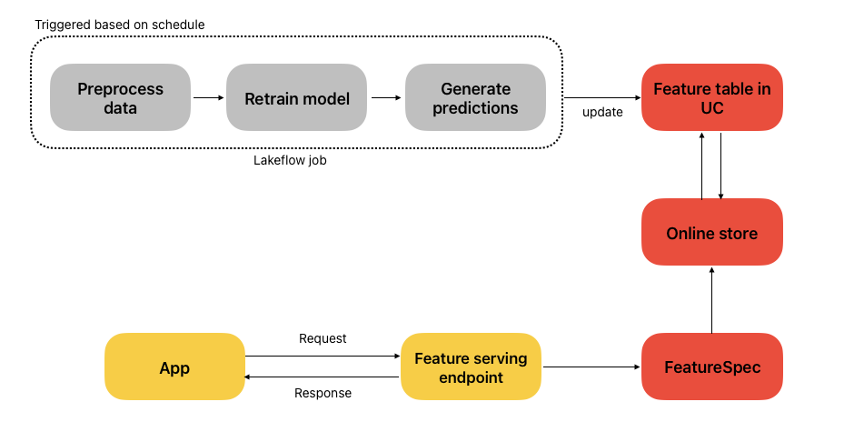
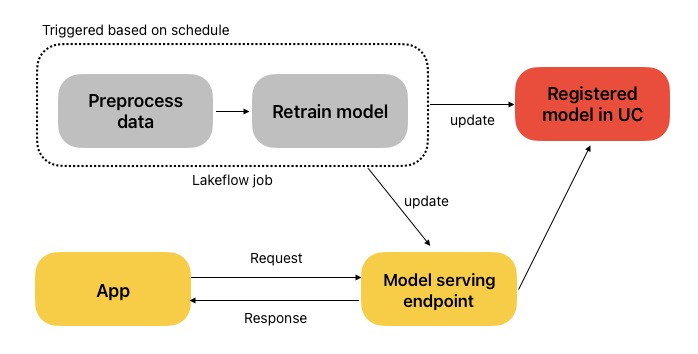
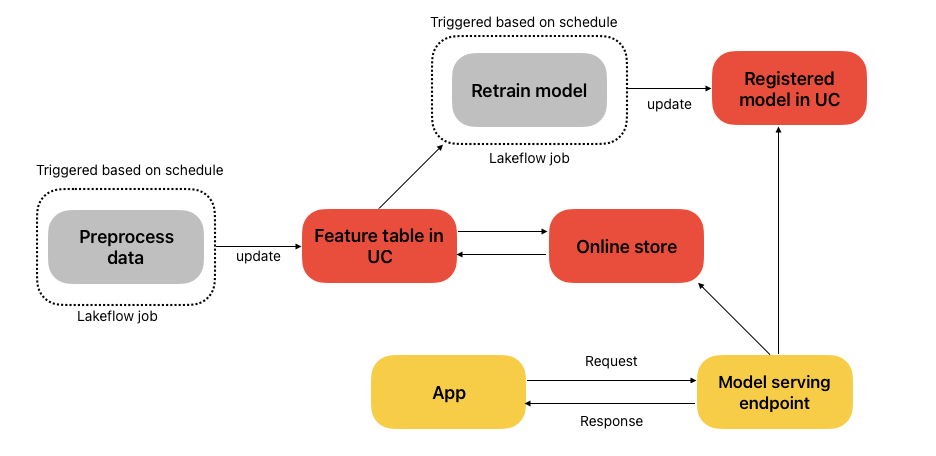

# Model Serving Architectures

## Lecture 5 of MLOps with Databricks Course

Special thanks to Maria Vechtomova 🌟

Databricks recently introduced Free Edition, which opened the door for us to create a free hands-on course on MLOps with Databricks.

This article is part of the course series, where we walk through the tools, patterns, and best practices for building and deploying machine learning workflows on Databricks :

* Lecture 1: Introduction to MLOPs
* Lecture 2: Developing on Databricks
* Lecture 3: Getting started with MLflow
* Lecture 4: Log and register model with MLflow
* Lecture 5: Model serving architectures
* Lecture 6: Deploying model serving endpoint
* Lecture 7: Databricks Asset Bundles
* Lecture 8: CI/CD and deployment strategies
* Lecture 9: Intro to monitoring
* Lecture 10: Lakehouse monitoring

Model serving is a challenging topic for many machine learning teams. In an ideal scenario, the same team that develops a model, should be responsible for model deployment. However, this is not always feasible due to the knowledge gap or organizational structure. In that scenario, once model is ready, it is handed over to another team for deployment. It creates a lot of overhead when it comes to debugging and communication.

That’s where Databricks model serving can help a lot. Databricks model and feature serving use serverless, which simplifies the infrastructure side of the deployment, and a model endpoint can be created with one Python command (using Databricks sdk). It allows data science teams to own the deployment end-to-end and minimize the dependence on other teams.

In this article, we’ll discuss the following architectures:

- serving batch predictions (feature serving)
- model serving
- model serving with feature lookup

## Feature Serving

**Serving batch predictions** is probably one of the most popular and underestimated types of machine learning model deployment. Predictions are computed in advance using a batch process, stored in an SQL or in-memory database, and retrieved at request.

This architecture is very popular in the case of personal recommendation with low latency requirements. For example, an e-commerce store may recommend products to customers on various pages of the website.

Databricks Feature Serving is a perfect fit here. A scheduled Lakeflow job preprocesses data, retrains the model, and writes predictions to a feature table in Unity Catalog. These features are synced to an Online Store and exposed through a Feature Serving endpoint, defined by a FeatureSpec, a blueprint that combines feature functions (how features are calculated) with feature lookups (how they’re retrieved). Your application can then query this endpoint in real time to get fresh features for inference.

## Model Serving

**Model serving** assumes that model is deployed behind and endpoint, and all features are available through the payload. This is not the most realistic scenario, but can be still used in certain use cases, when models are embedded into apps and rely on user input from the app.

The figure below illustrates an automated model retraining and deployment pipeline on Databricks. A scheduled Lakeflow job preprocesses the data and retrains the model, which is then registered in Unity Catalog. The latest model is used to update a real-time serving endpoint, ensuring that applications always have access to the most up-to-date model.

This is the use case we cover in this course, and this is what we will deploy in the follow-up lecture, as Databricks Online store is not supported in Databricks Free edition.

## Model Serving with Feature Lookup

**Model serving with feature lookup** is the most complex (and most realistic) scenario that combines the ones we went through already. This architecture can be used for fraud detection, more complex recommendations, and many other use cases.

Here, some input features are passed with a request, some are retrieved from an Online Store (those features can be computed in a batch or streaming fashion, depending on your needs).

The figure below shows a simplified architecture for model serving with feature lookup. A scheduled Lakeflow job preprocesses data and updates a feature table in Unity Catalog, which is then synced to the online store. Another scheduled job retrains the model using the latest features and registers it in Unity Catalog. During inference, the model serving endpoint fetches features from the online store using a primary key, combines them with any features provided in the request payload, runs the model’s prediction function, and returns the result to the application.

## Conclusion

Databricks now supports a wide range of machine learning model deployment architectures. Even though they come with some limitations (for example, you have limited influence on the payload structure), it significantly simplifies the deployment.

In the next lecture, we’ll dive into implementation of model serving endpoint and show how the registered model can be used to expose real‑time predictions for downstream applications.